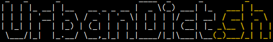
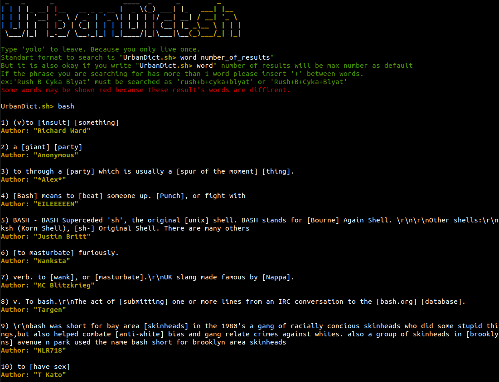
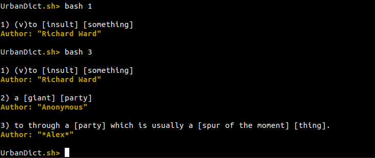
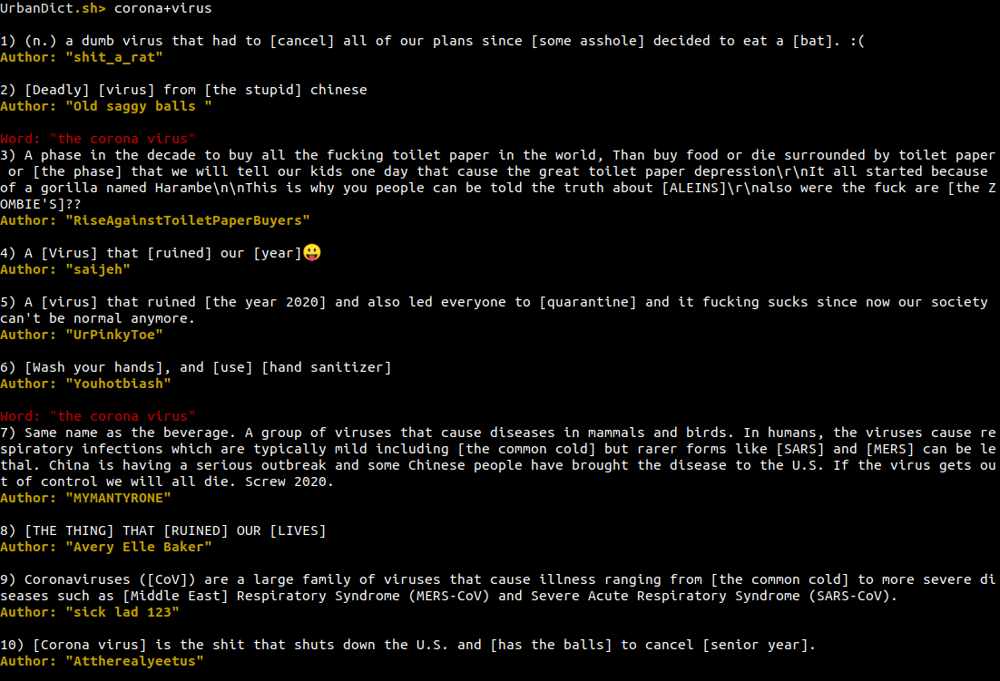
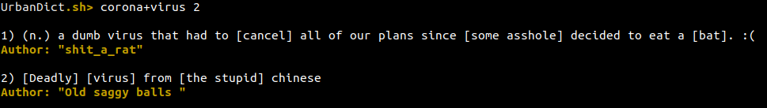
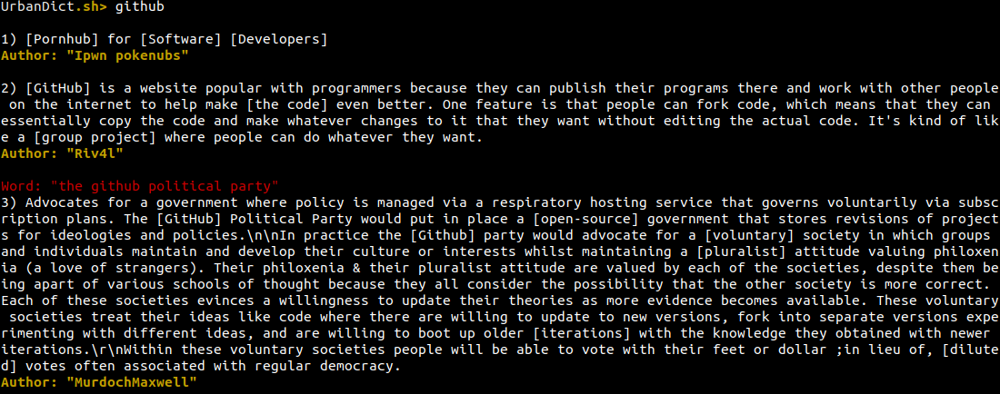

# 
## Table of Contents
1. [What is UrbanDict.sh](#what-is-urbandictsh)  
2. [How to use UrbanDict.sh](#how-to-use-urbandictsh)  
    2.1 [Single Word Query](#single-word-query)  
    2.2 [Multi Word Query](#multi-word-query)  
    2.3 [What are those red words?](#what-are-those-red-words)  
    2.4 [Hidden Wise Mode](#hidden-wise-mode)  
3. [How to install UrbanDict.sh?](#how-to-install-urbandictsh)  
4. [Conclusion](#conclusion)
## What is UrbanDict.sh?
UrbanDict.sh is a straightforward bash tool in which you can query words in Urban Dictionary and get definitions via using Unofficial Urban Dictionary API from RapidAPI.

## How to use UrbanDict.sh?
After following the installation process, you will already be able to open the program. So there are two types of inputs in the program. 
```shell
UrbanDict.sh> word number_of_results
#word: Query String
#number_of_results: Integer number of results user wants to see.
```
Or a lazy user can type the word and list all the available definitions.
```shell
UrbanDict.sh> word
```

### Single Word Query
**Lazy user:**  

  

**Hardworking nerd user:**  

  
### Multi Word Query
Sometimes you might want to search for word phrases, it is possible, but there is a rule you have to combine words with '+' ex:'``Rush B Cyka Blyat``' must be searched as '``rush+b+cyka+blyat``' or '``Rush+B+Cyka+Blyat``'.
**Lazy user:**  



**Hardworking nerd user:**  



### What are those red words?
Sometimes your query doesn't match with the exact word, or there are highly rated and semantically/syntactically close word(s) to your query, so in this case, these close words show up with their definitions below.   


  
### Hidden Wise Mode
It is basically stealth mode for this app. To turn it on you have to pass '--hidden-wise arguement' flag like ``bash UrbanDict.sh --hidden-wise``. You can also specify the amount of queries in each querying by ``bash UrbanDict.sh --hidden-wise 2`` in this case program will return 2 definition for your query. It can be used simply by selecting the word by double clicking on it or selecting it via mouse. You have to download [wl-clipboard](https://github.com/bugaevc/wl-clipboard.git) to program to perform hidden wise mode.

## How to install UrbanDict.sh?
I am programming bash for two days, so I will only be able to show how I use it as a real noob 😎.  
Firstly clone the repo to your local.
```git
$ git clone https://github.com/patern0ster/UrbanDict.sh.git
```

After cloning, you have to get an API key from [this link](https://rapidapi.com/community/api/urban-dictionary), which takes you to urban dictionaries' unofficial API on [RapidAPI](https://rapidapi.com). You have to sign up or sign in to get your X-RapidAPI-Key; after signing in, make sure you copy your API key on your clipboard. Now you are about to be ready to start using the UrbanDict.sh.  

Open the ``UrbanDict.sh`` on your favorite text editor. And add your X-RapidAPI-Key to the specified place and in the specified format.
```shell
#Program won't work if you don't put the key below
#And make sure you write your API key adjacent to 'API_KEY=' 
#It should be looking like: 'API_KEY=1234' or API_KEY='1234'
API_KEY=

```
Lastly, you have to download ``jq`` by clicking [here](https://stedolan.github.io/jq/download/) to let the program parse the JSON.  

Now you are ready to use the program. There are two ways to execute the program. For use first way, you have to go to the directory where you cloned the UrbanDict.sh and give every permission to the program.  
```shell
$ chmod 777 UrbanDict.sh
$ ./UrbanDict.sh
```

Or you can do:

```shell
$ bash UrbanDict.sh
```
## Conclusion
I hope this little project can help you improve your skills as well. I definitely had fun while writing code for this project. It is entirely okay if you want to use the code on another project. Thank you for reading.
